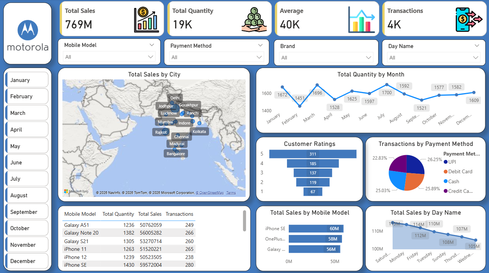
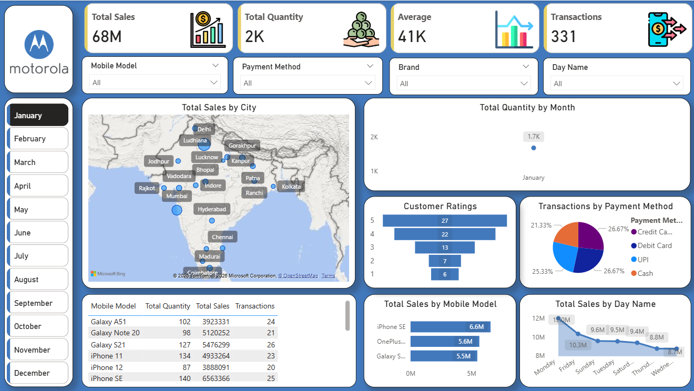
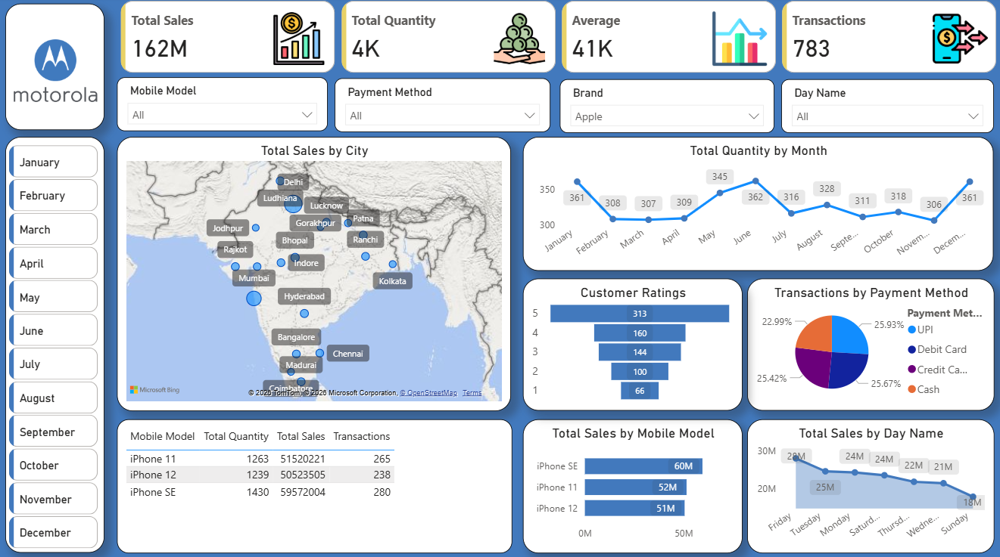

# 📊 Mobile Sales Dashboard | Power BI

An interactive **Power BI Dashboard** developed to analyze mobile sales performance across different cities, brands, payment methods, and time periods. The dashboard provides business insights through dynamic visualizations, KPIs, and filters to support data-driven decision making.

---

## 🚀 Project Overview

This dashboard helps analyze:

- 📈 Total Sales Performance
- 📦 Total Quantity Sold
- 💰 Average Sales
- 🧾 Total Transactions
- 🏙️ City-wise Sales Distribution
- 📱 Mobile Model Performance
- ⭐ Customer Ratings
- 💳 Payment Method Analysis
- 📅 Monthly & Day-wise Sales Trends

---

## 🛠️ Tools & Technologies

- Power BI Desktop
- Power Query
- DAX
- Microsoft Excel

---

## 📌 Key Features

- Interactive dashboard with slicers and filters
- Dynamic KPI Cards
- Geographical Sales Analysis using Map Visual
- Monthly Sales Trend Analysis
- Payment Method Distribution
- Customer Rating Analysis
- Mobile Model Performance Comparison
- Transaction Summary Table
- Clean and Business-Oriented Dashboard Design

---

# 📷 Dashboard Screenshots

## 🏠 Main Dashboard



---

## 📅 Dashboard with Month Filter



---

## 📱 Dashboard with Brand Filter



---

## 📂 Dataset

The dashboard uses the **Mobile Sales Dataset** provided in Excel format.

Dataset File:

```
mobile_sales_data.xlsx
```

---

## 📁 Project Structure

```
mobile-sales-dashboard/
│
├── dashboard.pbix
├── mobile_sales_data.xlsx
├── README.md
└── images
    ├── dashboard.png
    ├── dashboard_month_filter.png
    └── dashboard_brand_filter.png
```

---

## ▶️ How to Use

1. Download the repository.
2. Open `dashboard.pbix` using **Power BI Desktop**.
3. Interact with filters and slicers to explore insights.


